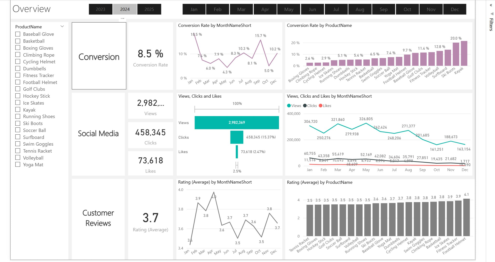
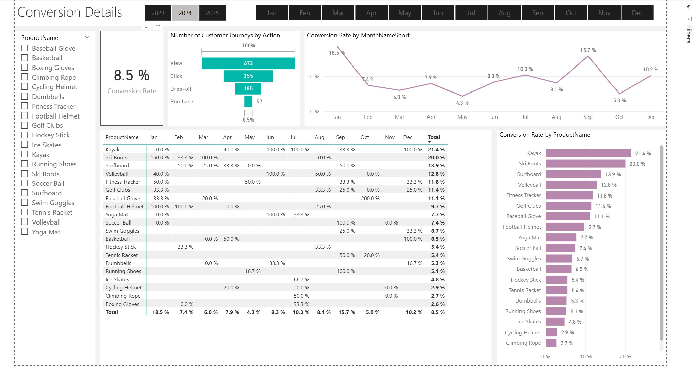
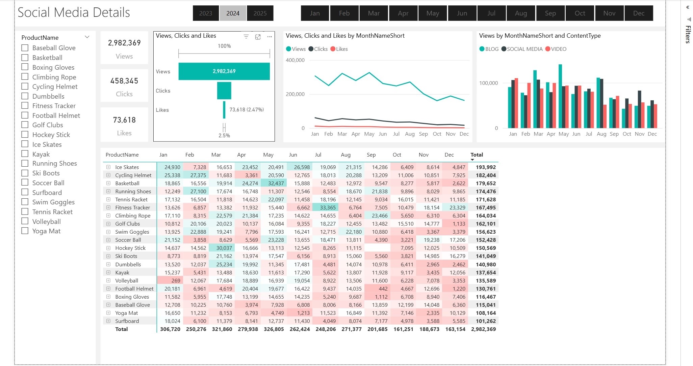
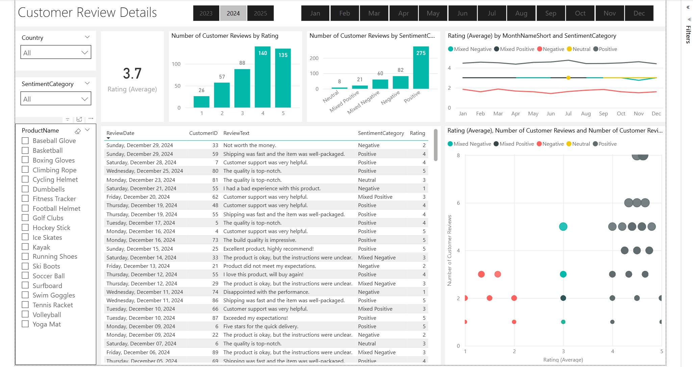

# 📊 Marketing Analytics Portfolio Project

### End-to-End Data Analytics Project using SQL, Python & Power BI

---

## 🚀 Project Overview

This project demonstrates a complete **end-to-end Marketing Analytics workflow** simulating a real-world business environment. The objective is to transform raw marketing and customer data into actionable business insights using modern data analytics tools.

The project covers the full analytics lifecycle:

* Business Understanding
* Data Modeling & Warehousing (SQL)
* Data Processing & Enrichment (Python)
* Data Analysis & Metrics Creation
* Interactive Dashboard Development (Power BI)
* Business Presentation & Insights

This repository is designed as a **Data Analyst Portfolio Project** showcasing practical industry skills.

---

## 🎯 Business Objective

The goal of this project is to analyze marketing performance and customer behavior to answer key business questions:

* How customers interact with marketing campaigns
* Engagement performance across channels
* Customer journey effectiveness
* Product performance insights
* Customer sentiment from reviews
* Conversion and engagement trends

---

## 🧱 Project Architecture

```
Raw Data
   ↓
SQL Data Warehouse (Star Schema)
   ↓
Python Data Enrichment
   ↓
Power BI Data Model
   ↓
Interactive Dashboard & Insights
```

---

## 🛠️ Tech Stack

| Category        | Tools Used   |
| --------------- | ------------ |
| Database        | SQL Server   |
| Query Language  | T-SQL        |
| Programming     | Python       |
| Data Processing | Pandas       |
| Visualization   | Power BI     |
| Analytics       | DAX          |
| Version Control | Git & GitHub |

---

## 🗂️ Repository Structure

```
Marketing Analytics
│
├── Marketing Analytics Business Case.pptx
│
├── SQL Data Warehouse
│   ├── dim_customers.sql
│   ├── dim_products.sql
│   ├── fact_customer_reviews.sql
│   ├── fact_engagement_data.sql
│   └── fact_customer_journey.sql
│
├── Python Processing
│   ├── customer_reviews_enrichment.py
│   └── fact_customer_reviews_enrich.csv
│
├── Power BI
│   ├── Dashboard.pbix
│   └── Calendar DAX Script.txt
│
├── Presentation Example.pptx
│
└── README.md
```

---

## 🧩 Data Modeling (SQL)

A **Star Schema** data warehouse design was implemented.

### Dimension Tables

* dim_customers
* dim_products

### Fact Tables

* fact_customer_journey
* fact_engagement_data
* fact_customer_reviews

This structure enables efficient analytical querying and scalable reporting.

---

## 🐍 Python Data Enrichment

Python was used to enhance customer review data by:

* Cleaning raw text data
* Preparing enriched datasets
* Exporting processed data for reporting

Key library used:

```
pandas
```

---

## 📈 Power BI Dashboard

The Power BI dashboard provides interactive analytics including:

* Marketing performance KPIs
* Engagement metrics
* Customer journey analysis
* Review sentiment insights
* Conversion tracking
* Trend analysis over time

### Key Features

* Dynamic filters
* KPI cards
* Time intelligence using DAX
* Interactive visuals

---

## 📊 Key Metrics Created

* Total Clicks
* Total Views
* Total Likes
* Number of Campaigns
* Customer Journey Count
* Customer Reviews Count
* Average Rating
* Conversion Rate

---

## 📌 Business Insights Delivered

This project helps stakeholders:

* Identify high-performing campaigns
* Understand customer engagement behavior
* Improve marketing ROI
* Monitor customer sentiment
* Optimize conversion funnels

---

## 💼 Skills Demonstrated

* Data Warehousing
* SQL Data Modeling
* ETL Concepts
* Python Data Processing
* Data Visualization
* DAX Calculations
* Business Analytics Storytelling

---

## 📷 Dashboard Preview

### 🧭 Main Dashboard


---

### 📈 Conversion Details Dashboard


---

### 📱 Social Media Dashboard


---

### ⭐ Customer Review Dashboard


## 🔮 Future Improvements

* Automated ETL pipeline
* Cloud deployment (Azure / AWS)
* Real-time dashboard refresh
* Advanced sentiment analysis using NLP
* Machine learning prediction models

---

## 👤 Author

Hamza Ahmed

Data Analytics Portfolio Project demonstrating a practical analytics workflow using SQL, Python, and Power BI.

---

